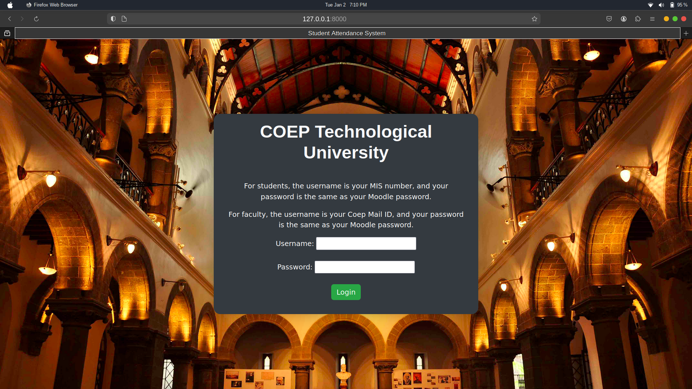

# COEP Student Attendance System

## Overview

The COEP Student Attendance System is a web-based application developed using Django. It provides a comprehensive solution for managing student attendance at the College of Engineering, Pune (COEP). The system is designed to streamline attendance tracking, making it easier for administrators, faculty members, and students to manage and access attendance records.

## Project Goals

The COEP Student Attendance System aims to achieve the following objectives:

1. **Eliminate Attendance Malpractice:** The system is designed to prevent the malpractice of marking false attendance, ensuring accurate and reliable attendance records.

2. **Streamline Processes and Reduce Paperwork:** By transitioning to a web-based platform, the project aims to streamline attendance tracking processes, making it more efficient and reducing the reliance on traditional paperwork.

3. **Empower Students:** The system empowers students by providing them with easy access to their attendance records. Students can conveniently monitor their attendance in enrolled courses, promoting transparency and accountability.

4. **Secure Login:** The application employs secure login mechanisms to protect user accounts and sensitive information.

   - **User Authentication:** Utilizes Django's built-in authentication system for secure user authentication.
   - **Password Encryption:** User passwords are securely encrypted before storage in the database using industry-standard cryptographic algorithms.
   - **Session Management:** Ensures secure session management to prevent unauthorized access.

5. **Additional Master Admin Functionalities:**
   - **Add Faculty and Student Records via CSV:** Master Admin can add multiple faculty and student records by uploading CSV files.
   - **Update Student Year:** After each semester, Master Admin can update student information, reflecting the change in academic years.
   - **Delete Attendance Records After Semester End:** Master Admin has the option to delete all attendance records at the end of each semester.

By addressing these goals and incorporating additional features, the COEP Student Attendance System is expected to contribute to a more efficient and transparent attendance management process at the College of Engineering, Pune.

## Features

- **User Roles:**
  - Different views and functionalities for Master Admin, Faculty, and Students.

## Tech Stack

- Frontend technologies:  
- Backend web framework: 
- Database for storing application data: 

## Usage

### General Views

- **Landing Page:** Access the landing page.
- **Logout:** Log out of the system.
- **Password Change:** Change the password.

### Master Admin

- **Home Page:** Access the Master Admin home page.
- **Student Management:**
  - Add, update, and delete student records.
  - Perform year-end updates for student information.
- **Faculty Management:**
  - Add, update, and delete faculty records.
- **Course Management:**
  - Add, update, and delete course records.
- **Course-Faculty Management:**
  - Associate faculty with courses.
  - Manage course-faculty assignments.
- **Attendance Management:**
  - View, delete, and generate reports for attendance records.
  - Additional functionalities:
    - Add Faculty and Student Records via CSV.
    - Update Student Year.
    - Delete Attendance Records After Semester End.

### Faculty

- **Home Page:** Access the Faculty home page.
- **Attendance Management:**
  - Mark attendance for students in assigned courses.

### Student

- **Home Page:** Access the Student home page.
- **Attendance Management:**
  - View detailed attendance reports for enrolled courses.

## Authors

- Aditya Prashant Choudhary (112103030) - TY Btech Computer Engineering Div 1
